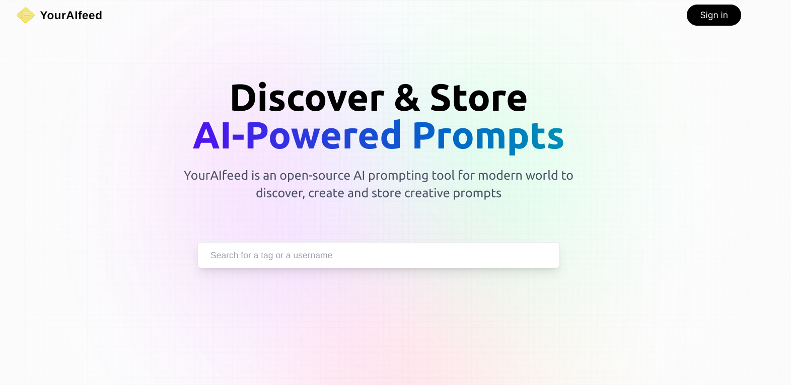

**Promptfeed** is an open-source AI prompting tool for modern world to discover, create and store creative prompts. The application employs advanced machine learning algorithms to analyze user interactions, understand preferences, and continuously refine the content recommendations. It aggregates information from various sources, including news articles, blog posts, and social media, providing users with a one-stop platform for staying informed on topics that matter to them.

## Inspiration
The inspiration behind PromptFeed stems from the growing need for personalized and efficient content curation in the ever-expanding world of information. As technology advances, the amount of data available to users is increasing exponentially, making it challenging to stay updated on relevant and interesting topics. PromptFeed aims to address this challenge by leveraging artificial intelligence to deliver a tailored content experience.

## Tech Stack:
FullStack: Next.js for a dynamic and responsive user interface. Database: MongoDB for efficient data storage and retrieval.